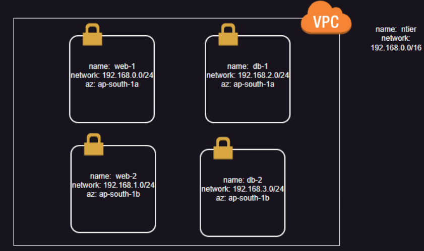

### In This ntier we have using Json to Create Templates

In Main.json
---------------
* Here we creates an Vpc(named Network, Zone : ap-south-1 & cidr : 192.168.0.0/16 ) using Template and upload it to stack.

In Main1.json
----------------
* in this we have creates 5 Resources They are 
    * VPC named as network : In side VPC(Zone : ap-south-1 & cidr : 192.168.0.0/16) they are 4 subnets They are 
        * web1subnet (zone : ap-south-1a & Address : 192.168.0.0/24)
        * web2subnet (zone : ap-south-1b & Address : 192.168.1.0/24)
        * de1subnet (zone : ap-south-1a & Address : 192.168.2.0/24)
        * db2subnet (zone : ap-south-1b & Address : 192.168.3.0/24)
OverView : 

In Main2.json 
----------------
 in this we have creates 7 Resources They are 
    * VPC named as network : In side VPC(Zone : ap-south-1 & cidr : 192.168.0.0/16) they are 4 subnets They are 
        * web1subnet (zone : ap-south-1a & Address : 192.168.0.0/24)
        * web2subnet (zone : ap-south-1b & Address : 192.168.1.0/24)
        * de1subnet (zone : ap-south-1a & Address : 192.168.2.0/24)
        * db2subnet (zone : ap-south-1b & Address : 192.168.3.0/24)
        * create an internet gateway and attach it to vpc (Named : igw)
        * Create a route table(public), route to internet gateway and subnet association